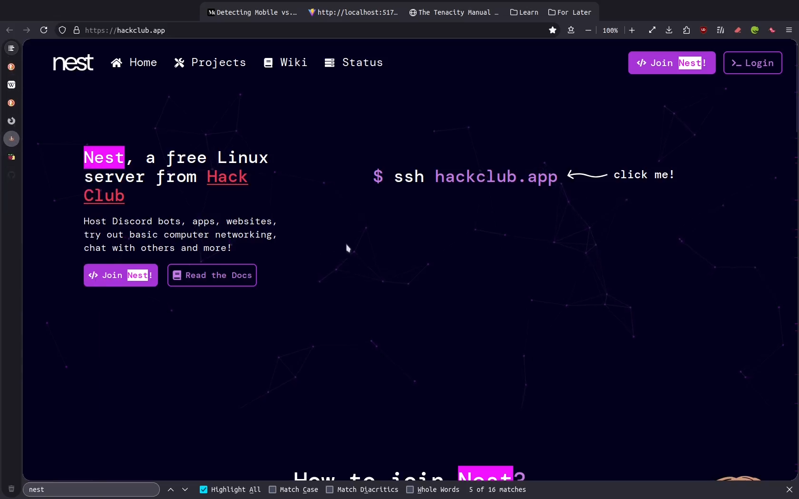

# Firefox CSS

My personal CSS styles for Firefox ([Librewolf](https://librewolf.net/)).

Features:

- auto-collapsible tabs sidebar
  - requires [Sidebery](https://github.com/mbnuqw/sidebery) and [sidebery custom styles](./sidebery.css)
- original tabs are hidden
- bookmarks toolbar centered and fixed at the top of the browser
  - smart overflow handling
- rounded UI (even icons)

Getting those features to work flawlessly took a lot of time...

## How to use

1. Create a a userChrome.css file: [How to Create a userChrome.css File](https://www.userchrome.org/how-create-userchrome-css.html)
2. Copy the contents of [userChrome.css] to your userChrome.css
3. Install [Sidebery](https://github.com/mbnuqw/sidebery)
4. Copy the styles from [sidebery.css] to "Styles editor" (can be found in the addon settings)
5. Enjoy!

## License

Everything in this repository is licensed under the [Mozilla Public License Version 2.0](./LICENSE) unless stated otherwise.
